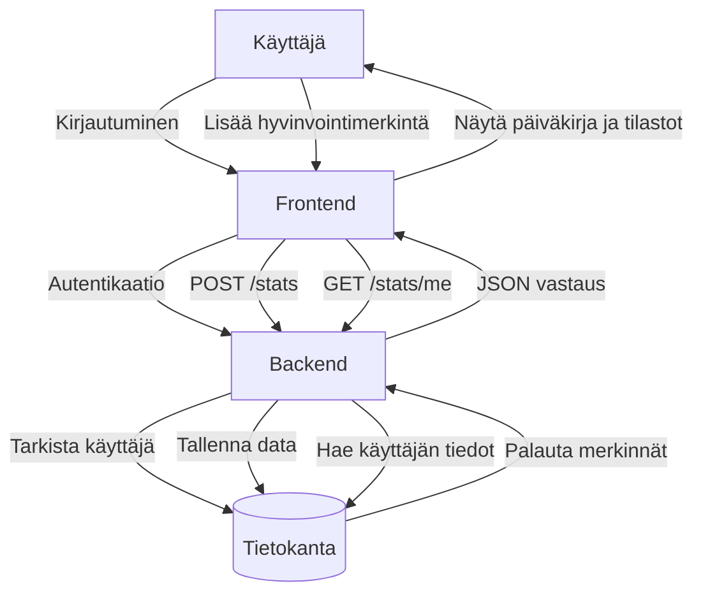
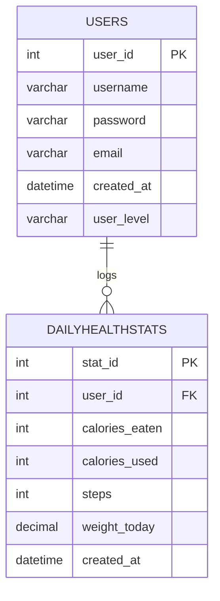
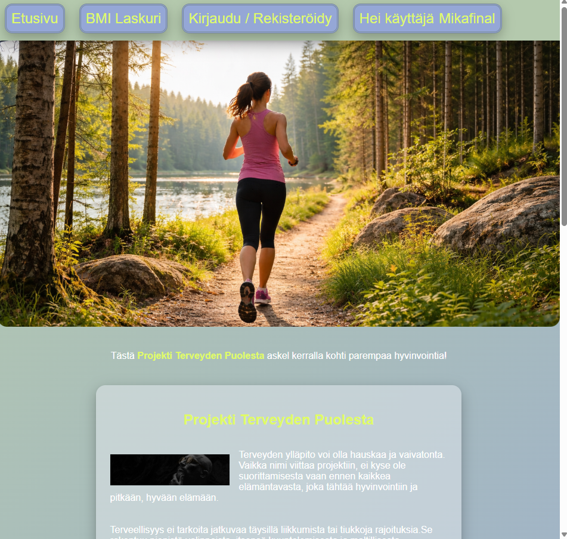

# Omakanta / Hyvinvointipäiväkirja

## Sovelluksen ominaisuudet

Sovellus on hyvinvointipäiväkirja, johon käyttäjä voi kirjata omia terveystietojaan ja seurata hyvinvointiaan.

Sovelluksen keskeiset ominaisuudet:
- käyttäjän kirjautuminen
- käyttäjän rekisteröityminen
- käyttäjän omien tietojen hakeminen tokenin avulla
- päiväkirjamerkintöjen lisääminen
- päiväkirjamerkintöjen hakeminen
- päiväkirjamerkintöjen päivittäminen
- päiväkirjamerkintöjen poistaminen
- hyvinvointitietojen yhteenveto, kuten askelten keskiarvo ja painon muutos
- bmi laskuri jolla voi tarkistaa oman bmi arvonsa

## Tietokannan rakenne

Sovelluksessa käytetään tietokantaa, jossa on esimerkiksi seuraavat taulut:

### usersq
Sisältää käyttäjien tiedot.
- `user_id` (PK)
- `username`
- `password`
- `email`
- `created_at`
- `user_level`

### dailyhealthstats
Sisältää käyttäjän päiväkirjamerkinnät.
- `stat_id` (PK)
- `user_id` (FK -> users.user_id)
- `calories_eaten`
- `calories_used`
- `steps`
- `weight_today`
- `created_at`
- `entry_date`
- `mood`
- `weight`
- `sleep_hours`
- `notes`

## Sovelluksen arkkitehtuuri

Alla oleva kaavio kuvaa sovelluksen toimintalogiikkaa käyttäjän, frontendin, backendin ja tietokannan välillä.

### Tietokannat ja niiden yhteydet

### Relaatiot
- yhdellä käyttäjällä voi olla monta päiväkirjamerkintää
- jokainen päiväkirjamerkintä kuuluu yhdelle käyttäjälle

## Kuvakaappaukset sovelluksen keskeisistä näkymistä selaimessa

### Etusivunäkymä

### Kirjautumis näkymä

### Pääsivu/päiväkirjanäkymä

### Merkinnän muokkaus

### Bmi laskuri

## Käytetyt lähteet

Sovelluksessa on hyödynnetty seuraavia lähteitä:
- kurssin materiaalit
- MDN Web Docs
- Express-dokumentaatio
- MySQL2-dokumentaatio
- JWT-autentikointiin liittyvät lähteet
- google
- Chatgpt

## AI:n hyödyntäminen

Projektissa on hyödynnetty tekoälyä ohjelmoinnin tukena. Tekoälyä käytettiin esimerkiksi:
- virheiden etsimiseen ja selittämiseen
- SQL-kyselyiden tarkistamiseen
- frontend- ja backend-koodin yhteentoimivuutta put ja delete lisäyksissä
- erilaisten css ulkoasujen vinkkaukseen
- README-tiedoston ja dokumentaation pohjaan

Tekoäly ei tuottanut valmista projektia kokonaan, vaan sitä käytettiin oppimisen tukena ja yksittäisten ongelmien ratkaisemiseen.

Lisäksi AI:n käyttö on merkitty tarpeen mukaan myös lähdekoodin kommentteihin.

## Linkit

### GitHub-repositorio
[Backend.](https://github.com/MikaPoikonen/hyte-backend/tree/backend-final)

[Frontend.](https://github.com/MikaPoikonen/hyte-frontend/tree/frontend-final)

### Julkaistu sovellus
Lisää tähän linkki julkaistuun sovellukseen, jos se on olemassa.

### Dokumentaatio
Lisää tähän linkit mahdolliseen muuhun dokumentaatioon.