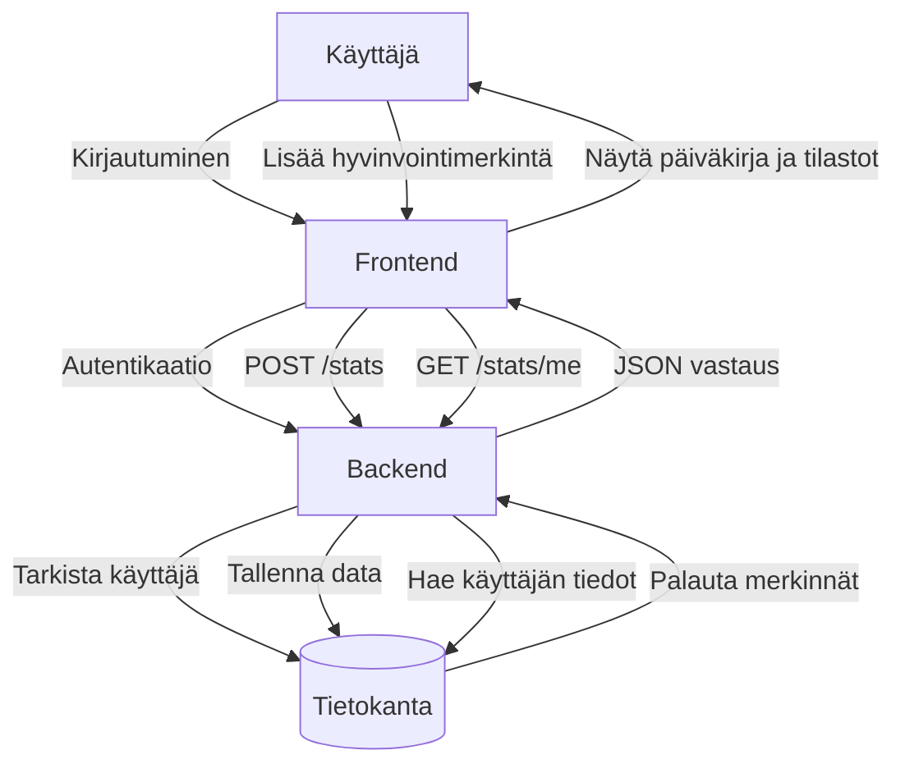
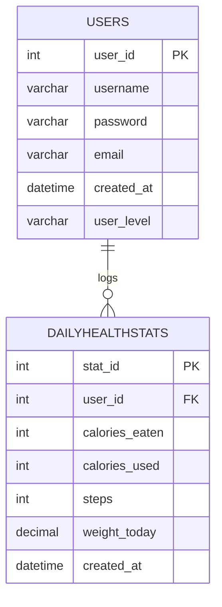
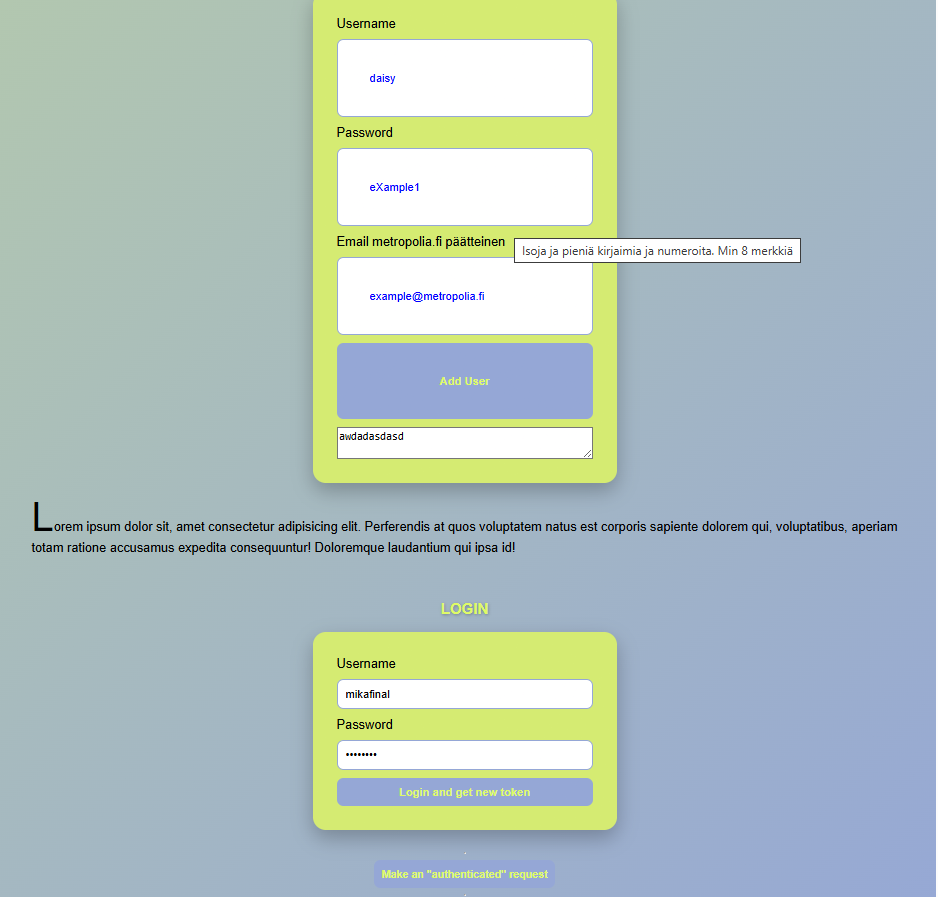
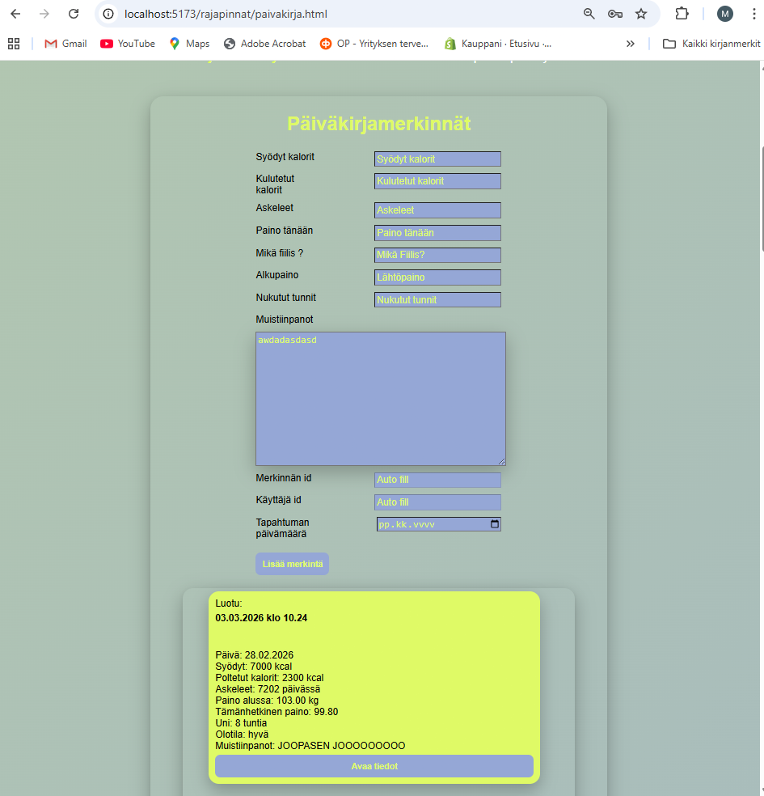
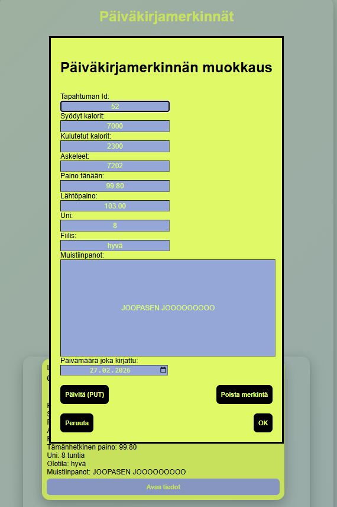
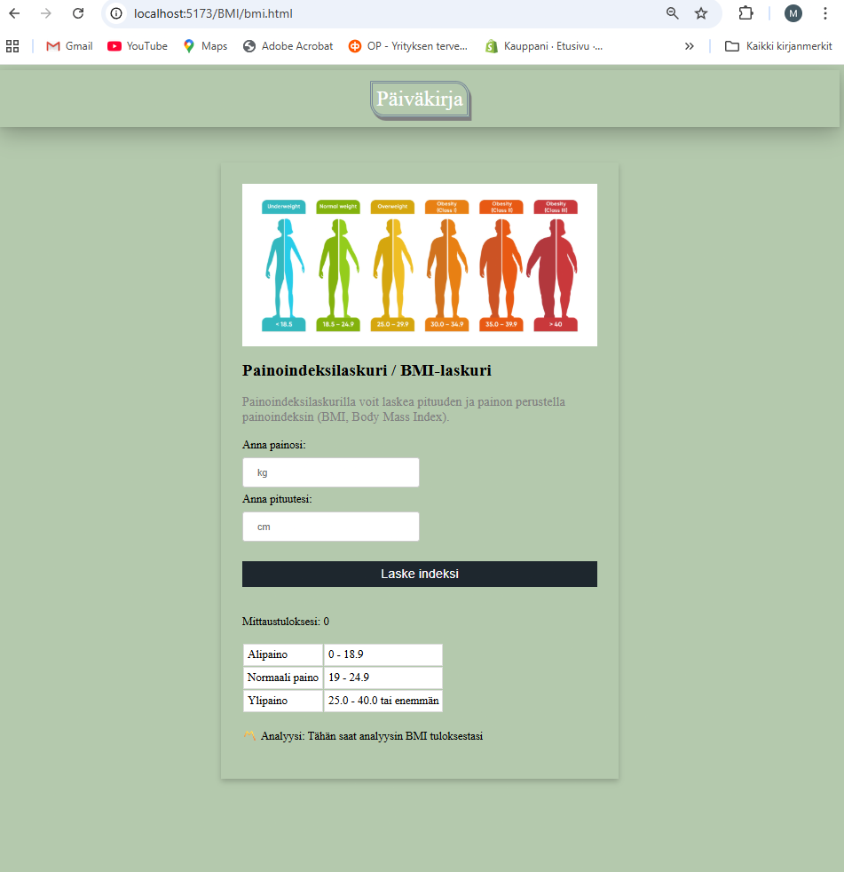

# Omakanta / Hyvinvointipäiväkirja

## Sovelluksen ominaisuudet

Sovellus on hyvinvointipäiväkirja, johon käyttäjä voi kirjata omia terveystietojaan ja seurata hyvinvointiaan.

Sovelluksen keskeiset ominaisuudet:
- käyttäjän kirjautuminen
- käyttäjän rekisteröityminen
- käyttäjän omien tietojen hakeminen tokenin avulla
- päiväkirjamerkintöjen lisääminen
- päiväkirjamerkintöjen hakeminen
- päiväkirjamerkintöjen päivittäminen
- päiväkirjamerkintöjen poistaminen
- hyvinvointitietojen yhteenveto, kuten askelten keskiarvo ja painon muutos
- bmi laskuri jolla voi tarkistaa oman bmi arvonsa

## Tietokannan rakenne

Sovelluksessa käytetään tietokantaa, jossa on esimerkiksi seuraavat taulut:

### usersq
Sisältää käyttäjien tiedot.
- `user_id` (PK)
- `username`
- `password`
- `email`
- `created_at`
- `user_level`

### dailyhealthstats
Sisältää käyttäjän päiväkirjamerkinnät.
- `stat_id` (PK)
- `user_id` (FK -> users.user_id)
- `calories_eaten`
- `calories_used`
- `steps`
- `weight_today`
- `created_at`
- `entry_date`
- `mood`
- `weight`
- `sleep_hours`
- `notes`

## Sovelluksen arkkitehtuuri

Alla oleva kaavio kuvaa sovelluksen toimintalogiikkaa käyttäjän, frontendin, backendin ja tietokannan välillä.

### Tietokannat ja niiden yhteydet

## Sovelluksen rakenne

Frontend koostuu useista HTML-sivuista ja niiden JavaScript-tiedostoista.  
Frontend buildataan Vitellä, jonka jälkeen tuotetut tiedostot kopioidaan Apache-palvelimen webrootiin (`/var/www/html`).

Apache palvelee frontendin staattiset tiedostot ja välittää kaikki `/api`-alkuiset pyynnöt Express-backendille reverse proxyn kautta.

Backendissä `src/index.js` lataa reitit:
- `user-router.js`
- `omakanta-router.js`

Reitit kutsuvat controllereita:
- `user-controller.js`
- `omakanta-contoller.js`

Backend käyttää MariaDB-tietokantaa `harjoitus`, jossa taulut ovat:
- `users`
- `dailyhealthstats`

Taulu `dailyhealthstats` viittaa `users`-tauluun `user_id`-foreign keyllä.

### Tiedosto kaavio
flowchart LR

subgraph Frontend
    index[index.html]
    login[login.html]
    paivakirja[paivakirja.html]

    loginJS[src/js/login.js]
    diaryJS[src/js/paivakirja.js]
    apiJS[src/js/omakanta-api.js]

    css[CSS tiedostot]
end

subgraph Backend
    server[src/index.js]

    userRouter[src/routes/user-router.js]
    omakantaRouter[src/routes/omakanta-router.js]

    userController[src/controllers/user-controller.js]
    omakantaController[src/controllers/omakanta-contoller.js]

    auth[middlewares/authentication.js]
end

subgraph Database
    users[(users)]
    stats[(dailyhealthstats)]
end

index --> css
login --> loginJS
paivakirja --> diaryJS

diaryJS --> apiJS
loginJS --> server
apiJS --> server

server --> userRouter
server --> omakantaRouter

userRouter --> userController
omakantaRouter --> omakantaController

omakantaRouter --> auth

userController --> users
omakantaController --> stats

stats -->|user_id| users

### Referenssit ja kirjastot
- Oppimisessa on käytettu Ulla Söderlöf ja Matti Peltoniemi Githubin opetusmateriaalia niin fron-endissä kuin back-endissä.
- Oppimateriaalia on osittain käytetty suoraan ja myös muokattu projektiin sopivaksi
- 

### Relaatiot
- yhdellä käyttäjällä voi olla monta päiväkirjamerkintää
- jokainen päiväkirjamerkintä kuuluu yhdelle käyttäjälle

## Kuvakaappaukset sovelluksen keskeisistä näkymistä selaimessa

### Etusivunäkymä

### Kirjautumis näkymä

### Pääsivu/päiväkirjanäkymä

### Merkinnän muokkaus

### Bmi laskuri

### Käytetyt teknologiat

### Projektissa on käytetty seuraavia teknologioita:

- Node.js – palvelinpuolen JavaScript-ajoympäristö

- Express.js – REST API -palvelimen toteutus

- MariaDB / MySQL – tietokanta

- Vite – frontend build-työkalu

- Apache2 – web-palvelin Azure-virtuaalikoneella

- JWT (JSON Web Token) – käyttäjän autentikointi

- PM2 – Node.js-sovelluksen prosessien hallinta

- Azure Virtual Machine (Ubuntu) – sovelluksen julkaisuympäristö

- Käytetyt Node.js kirjastot

### Backendissä käytetyt keskeiset kirjastot:

- express – web framework Node.js:lle

- mysql2 – yhteys MariaDB/MySQL-tietokantaan

- jsonwebtoken – JWT-tokenien luominen ja tarkistus

- bcrypt – salasanojen hashäys

- dotenv – ympäristömuuttujien hallinta (.env)

- express-validator – syötteiden validointi

- cors – cross-origin pyyntöjen hallinta

### Frontend kirjastot ja työkalut

- Frontendissä käytetyt työkalut:

- Vite – frontend build ja kehityspalvelin

- JavaScript (ES Modules) – sovelluslogiikka

- Fetch API – REST API -kutsut

- HTML5 ja CSS3 – käyttöliittymä

### Grafiikka ja media

### Projektissa käytetty grafiikka on pääasiassa:

- Itse tuotettua chatgpt

- Kuvat on optimoitu web-käyttöön Vite buildin yhteydessä.

## Käytetyt lähteet

Sovelluksessa on hyödynnetty seuraavia lähteitä:
- kurssin materiaalit
- MDN Web Docs
- Express-dokumentaatio
- MySQL2-dokumentaatio
- JWT-autentikointiin liittyvät lähteet
- google
- Chatgpt

## AI:n hyödyntäminen

Projektissa on hyödynnetty tekoälyä ohjelmoinnin tukena. Tekoälyä käytettiin esimerkiksi:
- virheiden etsimisen tukemiseen ja selittämiseen tarvittaessa miksi esim. koodi meni rikki.
- SQL-kyselyiden tarkistamiseen
- frontend- ja backend-koodin yhteentoimivuutta put ja delete lisäyksissä
- erilaisten css ulkoasujen vinkkaukseen
- README-tiedoston ja dokumentaation pohjaan

Tekoäly ei tuottanut valmista projektia kokonaan, vaan sitä käytettiin oppimisen tukena ja yksittäisten ongelmien ratkaisemiseen.

Lisäksi AI:n käyttö on merkitty tarpeen mukaan myös lähdekoodin kommentteihin.

Ai:lla luotu bannerikuva juoksija nainen

## Linkit

### GitHub-repositorio
[Backend.](https://github.com/MikaPoikonen/hyte-backend/tree/backend-final)

[Frontend.](https://github.com/MikaPoikonen/hyte-frontend/tree/frontend-final)

### Julkaistu sovellus
[Etusivu](https://mikapoihyte.norwayeast.cloudapp.azure.com/)

### Dokumentaatio
[Express.js](https://expressjs.com)
[Node.js](https://nodejs.org/en/docs)
[mariaDB](https://mariadb.com/docs)
[JSON Web Token](https://jwt.io/introduction)
[Express Validator](https://express-validator.githyb.io/docs/)
[Vite](https://vitejs.dev/guide/)
[Apache Web Server](https://httpd.apache.org/docs/)
[Azure Virtual Machine](https://learn.microsoft.com/en-us/azure/virtual-machines/)
[Let's Encrypt / Certbot](https://certbot.eff.org/)
